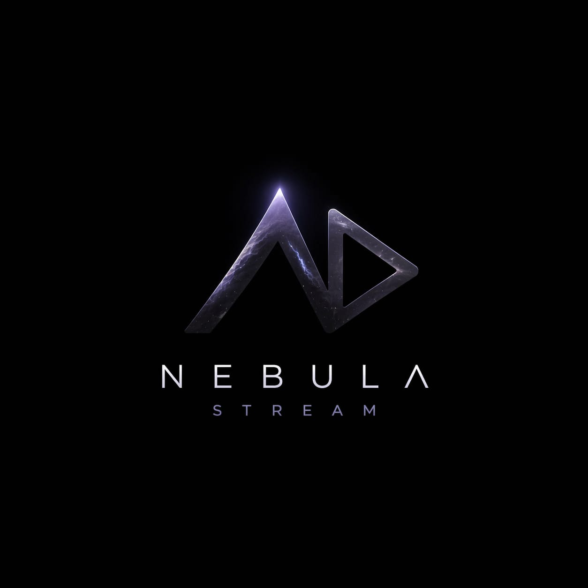

<div align="center">



# NebulaStreams V2

Self-host optimized multi-provider HTTP stream addon for Stremio.

</div>

## What Is Different In V2

- self-host defaults instead of public-host protection defaults
- request rate limiters disabled by default
- bot protection disabled by default
- memory guard disabled by default
- provider cooldowns disabled by default
- higher HTTP socket, provider concurrency, and result-cache ceilings
- provider execution tuned for broader coverage instead of aggressive early exit
- background refresh and popular prewarm disabled by default so live requests get the budget

This repo is intended for operators who want to run the addon on their own machine or VPS and tune the box for throughput.

## Default Runtime Model

V2 still keeps bounded concurrency for provider execution and host fan-out. That is intentional. Removing every internal bound would make the process easier to crash under real traffic. The public-facing throttles are disabled by default, but the internal scheduler still uses wider caps so the process can stay responsive under load.

## Local Start

```bash
npm ci
npm start
```

Default local endpoints:

- `http://127.0.0.1:3000/manifest.json`
- `http://127.0.0.1:3000/configure`
- `http://127.0.0.1:3000/health`

## Optional Environment Overrides

You do not need to set any env vars for a basic deploy. Import the repo on Render, let it run with defaults, and the addon will derive its public origin from the incoming request host.

Set overrides only when you actually need them:

```env
PUBLIC_BASE_URL=https://your-domain.example
TMDB_API_KEY=...
REDIS_URL=redis://127.0.0.1:6379
PROVIDER_GLOBAL_MAX_INFLIGHT=48
PROVIDER_HOST_MAX_INFLIGHT=6
PROVIDER_MAX_CONCURRENCY=12
STREMIO_FAST_PROVIDER_CONCURRENCY=10
STREMIO_FAST_PROVIDER_LIMIT=12
STREMIO_FAST_STREAM_LIMIT=120
MAX_ACTIVE_STREAMS=0
STREMIO_MAX_INFLIGHT_SEARCHES=0
PUBLIC_RATE_LIMIT_MAX_REQUESTS=0
STREAM_RATE_LIMIT_MAX_REQUESTS=0
PROVIDER_RATE_LIMIT_MAX_REQUESTS=0
BOT_PROTECTION_ENABLED=false
MEMORY_GUARD_ENABLED=false
```

Use `PUBLIC_BASE_URL` only if you want one fixed canonical origin, such as:

- a custom domain
- cache prewarming that should target exactly one public hostname
- a reverse-proxy setup where the incoming host header is not the public hostname

By default, V2 now derives a host-specific Stremio addon id for each deployment so self-hosted instances do not collide with each other inside Stremio. If you want one manually fixed addon id instead, set `STREMIO_ADDON_ID`.

`0` means disabled for:

- `MAX_ACTIVE_STREAMS`
- `STREMIO_MAX_INFLIGHT_SEARCHES`
- `PUBLIC_RATE_LIMIT_MAX_REQUESTS`
- `STREAM_RATE_LIMIT_MAX_REQUESTS`
- `PROVIDER_RATE_LIMIT_MAX_REQUESTS`
- provider cooldown thresholds / cooldown durations

## Deployment Notes

- Render works with the repo defaults. `render.yaml` only keeps the Node version, cache path, and an optional Redis placeholder.
- Use a VPS or dedicated machine if you want the wider V2 defaults to matter.
- Put a reverse proxy in front of it for TLS and connection reuse.
- Redis is optional but recommended if you want stronger cache persistence across restarts.
- If you run this behind a CDN or WAF, keep those protections outside the addon. V2 does not enable its own request throttles by default.

## Render

Import the repo as a Blueprint and deploy. No manual env setup is required for the default path.

If you later want a custom domain or Redis, add only those values.

## Vercel

V2 is not a good match for Vercel if you want full capability. This repo is a long-running Express process with in-memory state, filesystem cache, torrent streaming, and background work. Vercel runs request-bounded functions, not a persistent Node server, so it is the wrong target if you want the addon to run at full capacity.
